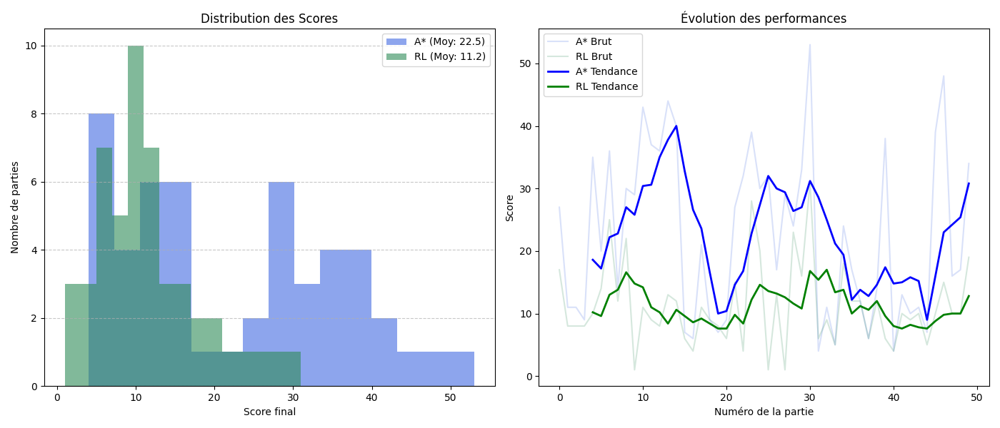

## 📊 Analyse des Benchmarks (A* vs RL)

Le graphique `comparison_chart.png` généré par nos scripts de test permet de comparer objectivement les performances des deux approches sur une série d'épisodes identiques.



### 📈 Interprétation des axes
* **Axe X (Épisodes)** : Représente la répétition des parties. Plus l'indice augmente, plus nous observons la stabilité de l'agent.
* **Axe Y (Score/Pas)** : 
    * **Score** : Efficacité à collecter la nourriture.
    * **Steps** : Efficacité du chemin (moins il y a de pas pour un score élevé, plus l'agent est optimal).

### 🔍 Analyse Comparative

| Métrique | Algorithme A* (Pathfinding) | Agent RL (Q-Learning) |
| :--- | :--- | :--- |
| **Comportement** | **Déterministe** : Calcule mathématiquement le chemin le plus court vers la cible. | **Stochastique** : Prend des décisions basées sur une table de probabilités apprise. |
| **Points Forts** | Atteint presque toujours la nourriture de manière optimale si un chemin existe. | Capable de généraliser et de survivre même dans des configurations denses. |
| **Limites** | Sensible aux calculs coûteux si la grille devient très complexe ou dynamique. | Dépend fortement de la qualité de l'entraînement et de la fonction de récompense. |

### 🧠 Observations Techniques (Basées sur le cours de R. Shibasaki)

L'agent RL utilise l'**Équation de Bellman** pour mettre à jour sa Q-Table. On peut observer sur les courbes :
1.  **Phase d'Exploration** : Au début, les scores du RL sont erratiques (l'agent teste des actions au hasard via la politique $\epsilon$-greedy).
2.  **Convergence** : Après un certain nombre d'épisodes, la courbe du RL se stabilise, montrant que l'agent a "compris" les concepts de danger et de récompense.
3.  **Écart de Performance** : L'A* sert de "ligne de base" (baseline). L'objectif du RL n'est pas forcément de dépasser l'A* en score pur, mais d'atteindre une efficacité comparable en utilisant uniquement sa perception sensorielle (11 bits).


---

### Comment régénérer ces données ?
Si vous modifiez les paramètres de l'IA (learning rate, discount factor) ou la fonction de récompense, vous devez relancer le benchmark pour mettre à jour le graphique :
```bash
uv run python benchmarks/run_duel_benchmark.py